*From one IP address to the whole cluster, without depending on an IOC list*

Someone sends you an IP address and says: this is a C2, find everything related to it.

So what do you actually do?

Most of us open VirusTotal first. Zero detections, maybe one. And now we are stuck, because the tool we trust says the IP is clean, while the incident response team is holding the implant and knows it is not.

Let's think about what that IP really is. It is the cheapest thing the attacker owns. A rented VPS that can be replaced in minutes. An IOC list full of IPs is a list of things that are already dying.

What the attacker cannot replace that fast is the way they build things: the C2 framework they picked, the defaults they never changed, the hosting provider they trust, the way they generate certificates, the naming pattern of their domains. That is what this article is about.

I will use Cobalt Strike, Havoc, Sliver, Brute Ratel and Mythic as examples, but this is not an article about hunting one of them. Frameworks change every year. The thinking stays the same, and it works for any C2 and for the threat actor operating it.

Look at which C2 is popular this year, then look again next year. In Kaspersky's Q1 2026 numbers on Securelist, Metasploit sits on top, Sliver and Havoc share second place, and Mythic is behind them even though it was more popular before. Not long ago, hunting C2 meant hunting Cobalt Strike and almost nothing else. Learn a tool and your knowledge has an expiry date. Learn the method and it follows you to the next framework.

One clarification before we start. I am not giving you Hunt s to copy and paste. Hunt s expire. The goal is that after reading this you can look at a C2 you have never seen before and know which questions to ask.

A small note about the queries. I write them as logic, with field names that look like Shodan or Censys. Even the same engine changes its syntax: Censys moved from its old Legacy Search to a new Platform in 2026, with a different query language and different field names. So translate the idea. Don't paste the text.

---

## Chapter 1: The Big Picture

### 1.1 Why Starting From an IOC Is Not Enough

An IOC tells you what happened yesterday. An IP, a domain, a hash. By the time it reaches a blocklist, the operator has usually moved to the next server.

But two servers deployed by the same operator, running the same framework, tend to look related. Not in the IP address. In the behavior. Same response headers, same certificate style, same ports, same provider.

So the question changes.

Not: is this IP bad?

But: what does this server look like to someone who connects to it, and who else looks exactly like that?

### 1.2 A C2 Server Is a Web Server With Habits

Most C2 frameworks talk to their implants over HTTP or HTTPS. That means the C2 has to behave like a web server: accept a request, return a status code, return headers, present a TLS certificate. Someone wrote that behavior inside the framework's source code, and unless the operator changes it, every server deployed from that framework inherits it.

Now the second half. Internet scanners connect to IP addresses all day and record what comes back. They don't care whether the server is malicious. So the C2 is already described inside a search engine, whether the operator wants that or not.

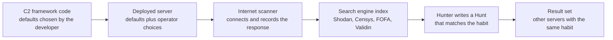

Hunting is reading that description backwards. We pick a trait of the server and ask the index who else has it.

### 1.3 What Does a Scanner Actually See?

Before writing any Hunt , we need to know which layers of a server are visible from the outside.

| Layer | What we get | Example of a pivot |
|---|---|---|
| Hosting context | Provider, ASN, country, open ports, OS banner | An actor that keeps using the same provider and the same port set |
| TLS | Certificate fields, key size, issuer, JARM | A default certificate subject, or a certificate generator that always fills the same field |
| HTTP response | Status code, header order and values, body hash | The default 404 response of a framework |
| Content | Page title, HTML hash, favicon hash | A panel that still ships its default icon |
| Other services | SSH host key, FTP banner, other open ports | One server image cloned many times |
| Application behavior | Whatever the scanner can extract from the service itself, such as a Cobalt Strike beacon config | Version, watermark, public key hash |
| Domain and DNS | Resolutions, naming patterns, certificates seen per domain | A fixed pattern such as victim name followed by a login-themed word |

Keep this table in your head. Every hunting Hunt  in the rest of the article is a combination of rows from it.

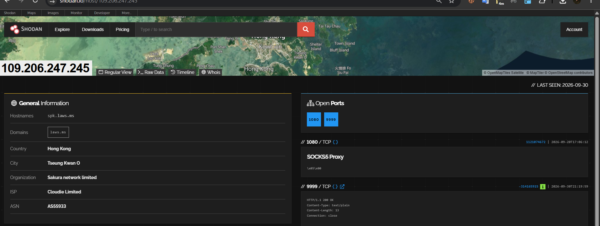 

### 1.4 Where Does the Data Come From?

When we say "the search engine", it sounds like one thing. It is not. It is several sources, and each one saw a different part of the internet on a different day.

| Source | Examples | What it knows | What it cannot tell you |
|---|---|---|---|
| Scanners | Shodan, Censys, FOFA, Netlas, Validin, Hunt.io | What a server answered when they connected | Anything on a port or a day they skipped |
| URL scanners | urlscan.io | What a web page looked like and what it loaded | Pages nobody submitted |
| Passive records | Passive DNS, certificate transparency, WHOIS | Names, certificates and registrations over time | Whatever was never logged |
| Malware side | Sandboxes, MalwareBazaar, ThreatFox, VirusTotal | Servers that real malware really contacted | Malware nobody caught |
| Open directory crawlers | Censys labels, Hunt.io | Files that operators left exposed | The operators who were careful |

Two things I want you to keep from this table.

First, every engine has blind spots. They scan from different networks, on different ports, on different schedules. So the same idea can give you different results in two engines. That is useful. When one engine shows nothing, ask a second one before you decide there is nothing to find. (There are tools that send one query to many engines. The open source uncover tool from ProjectDiscovery is one of them.)

Second, an index is a photograph, not a live camera. The engine remembers the day it visited. A server that lived for nine days may never be in it, or may already be gone from it. Engines also differ in how long they keep old data. Censys, for example, shortened how long stale services stay in its data in a 2026 backend update. So always read the last seen date.

### 1.5 Not Every C2 Is a Framework

We keep saying Cobalt Strike and Sliver, but a lot of what you meet every day is not a red team framework. It is a RAT with its panel. A stealer with its backend. A phishing kit. A server whose only job is to hand out payloads.

These look different from the outside. There is no default 404 and no team server port. Instead you get a login page, a few paths that repeat from one campaign to the next (things like /gate or /panel), and often several ports open on the same IP.

The mindset doesn't change. The question does. For a framework we ask: what does the listener say when nobody asks it a real question? For a panel we ask: what does the page look like, and which paths does it answer to?

---

## Chapter 2: The Hunting Loop

It doesn't matter which C2 you are hunting. The loop is the same.

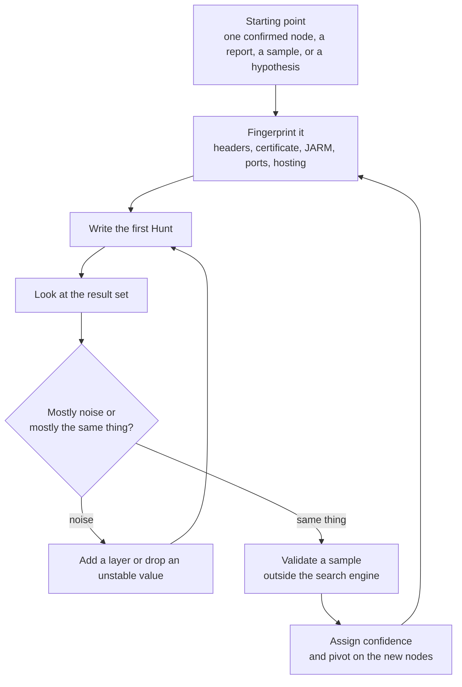


### 2.1 No Node? Start From a Hypothesis

Sometimes nobody gives you an IP. You can still hunt. You write down how you believe attackers behave, and you turn each belief into a filter.

The example I like uses four beliefs:

1. Attackers use redirects on their infrastructure to confuse analysts.
2. When they redirect, they often point to a big default site.
3. They prefer providers that are resilient and slow to take down.
4. They deploy on a common server OS.

On their own, each of these is useless. A search for redirects alone returns more than 22 million hosts and most of them are completely legitimate. But stack them: a redirect to a big default site, hosted at one provider, with one OS banner. The result set collapses to a handful of servers. In that exercise they all redirected to the website of a foreign ministry of defense, which is odd enough to deserve a second look. Pivoting on that redirect target found three more servers.

And the attribution? The honest answer was: we have a suspicion about which group it may be, but we are not certain.

That is the mindset. Each hypothesis is weak. The intersection of weak hypotheses is strong. And the conclusion is stated with the confidence it deserves.

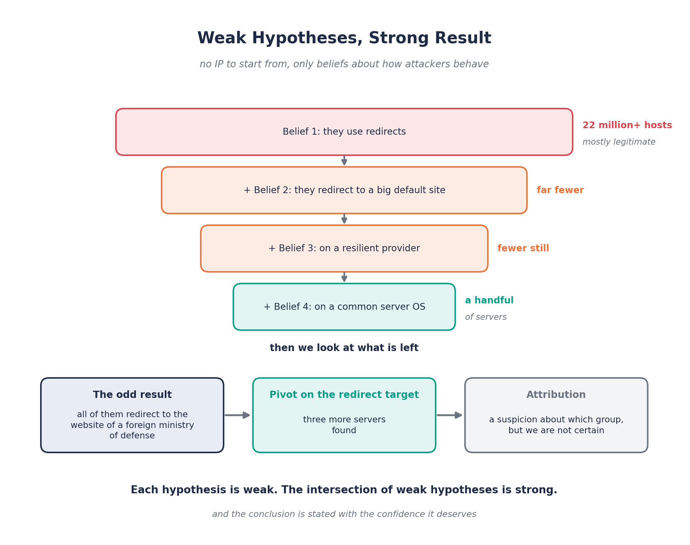

### 2.2 Start From the Malware: The Third Door

So far we had two ways in. Someone hands us a node, or we invent a hypothesis. There is a third way, and it might be the best one: start from the malware itself.

Why? Think about the difference between two sentences. "A scanner thinks this server looks like a C2." And "this sample connected to this server." The second one is not an opinion. Real malware talked to it. That is the strongest starting point we can get.

Imagine you open a public IOC feed and see a fresh entry tagged with a RAT family. Here is how I would walk it.

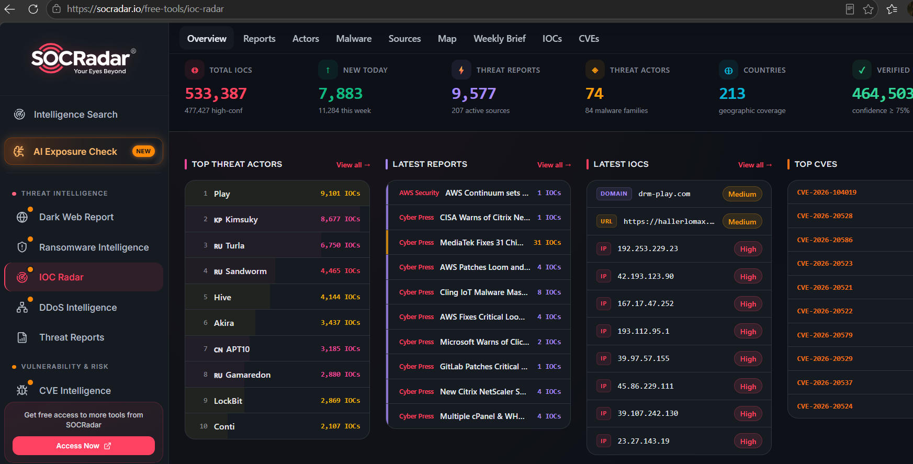

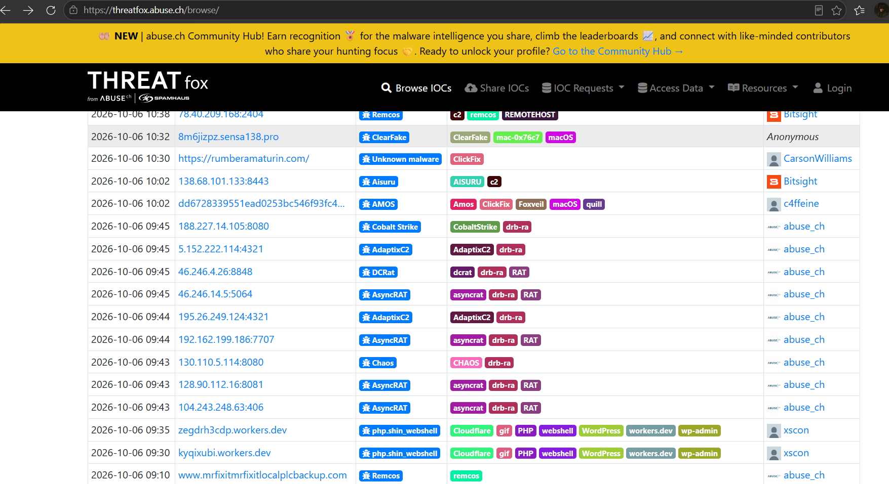

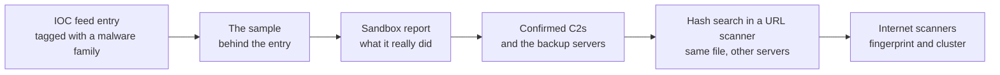

- Read the entry properly. Not only the IP. Look at the family, who reported it, when it was first and last seen, which ASN it sits in, and where the reference points.
- Get the sample. The reference often leads to a sample repository. A sample is worth more than any IOC, because you can run it.
- Read what it did. A sandbox report shows the addresses it contacted, the paths and request shapes it used, and the TLS details. Most important are the backup servers the malware tries when the first one is dead. I look at those first, because they will still be alive after the main server is gone.
- Search the sample's hash in a URL scanner. If the same file showed up next to other servers, those servers are candidates. Same malware, different C2. That is classic attacker behavior.
- Only now go to the scanners and fingerprint the new nodes, the same way as before.

One warning about tags. Labels like opendir or c2 on feeds and URL scanners were put there by a person or by automation. They are leads, not verdicts.

The mindset: a scanner tells you what a server looks like. A sandbox tells you what it did. The best hunts use both.

---

## Chapter 3: Where Does the Fingerprint Come From?

The loop starts with a fingerprint. In practice we get it from one of five places, depending on what we have in our hands.

### 3.1 We Have the Source Code

If the C2 or offensive tool is open source, we don't need to guess. We read the code like an analyst reading a log: looking for what the server says to the outside world.

Three things to check, every time:

- HTTP headers and responses. Search the repository for strings like HTTP, Headers, 404, 301, Redirect and Location. Build your own list of interesting strings.

EX:
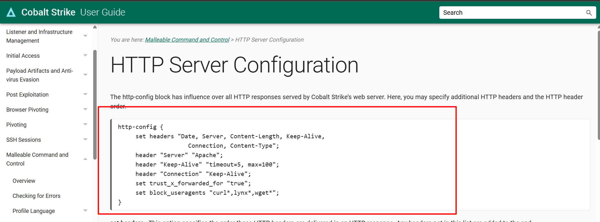

- Certificates. How does the framework generate or ship its certificate? Which subject fields does it fill?

EX:
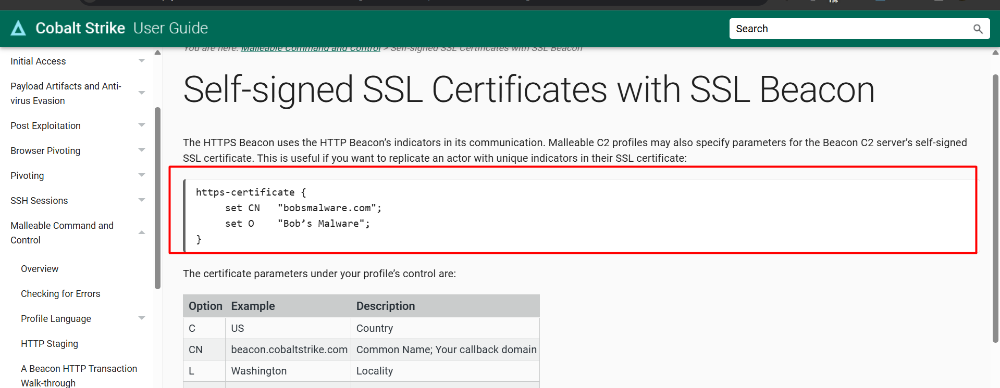

- Hardcoded strings. Anything the developer typed that ends up on the wire.

Ex:
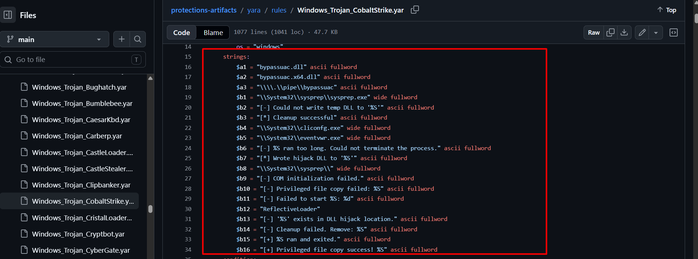

Here is why this works. The developer had to implement a web server response so the C2 looks like a normal website. Whatever they typed in that file is what thousands of operators deploy, unless the operator knows to change it.

A few examples of what this finds:

- Havoc ships a custom header inside its default 404 response. One unique string, one very clean Hunt .
EX:
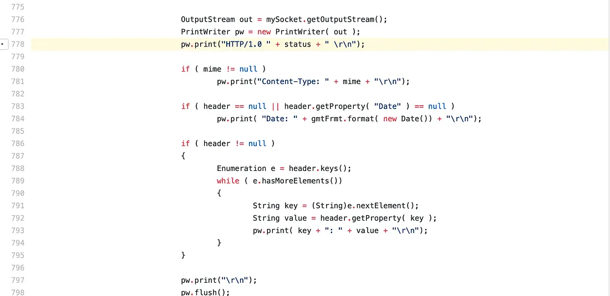

- PoshC2 ships a default certificate with recognizable values. Searching those values finds default deployments.
- Old versions of the Responder tool contain a hardcoded date string inside the response. Notice the limit here: it works only against the old versions, so know which version your string belongs to.
- Mythic gives you a default certificate and a default admin port. If the operator moves the admin port, the Hunt  keeps the same shape and only the port changes.

And one more useful point. Sometimes the tool you are reading is not a C2 at all. It is a redirector designed to protect one. RedWarden is an example. It also has defaults: which ports it listens on, where it redirects by default, which headers it adds. A tool designed to hide the C2 becomes another fingerprint.

### 3.2 We Don't Have the Source Code

Even if we don't have the source code, we can still fingerprint the C2 by looking at what it actually sends over the network.

We search for anything unusual in HTTP headers, responses, certificates, URLs, or other protocol behavior.

The idea is to find strings or behaviors that the developer or framework leaves behind and that can be seen from outside.

For example, a unique header, a specific 404 response, or a recognizable certificate value can become a fingerprint.

Ex:
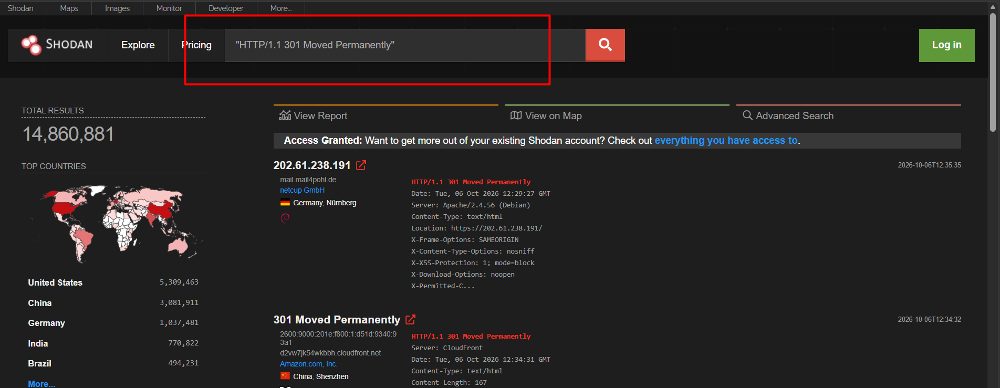

Then we check if this behavior is consistent across different deployments and versions.

We also need to know if the operator can easily change it, because configurable values are weaker indicators.

If a fingerprint only exists in older versions, we document that limitation instead of treating it as a universal Hunt .

So, whether we get the fingerprint from source code or from observing the traffic, the goal is the same: find something unique that we can hunt for.

Finally, we turn these fingerprints into practical detection or hunting opportunities.


### 3.3 The Tool Leaked, or the Profile Is Public

Sometimes the tool itself, a cracked build, or its configuration files are available publicly. This gives you another way to hunt: open them safely in a sandbox and look for values that could become visible on the wire.

The same applies to public C2 profiles. If an operator uses a public profile without changing it, things like unique URIs, headers, or certificate values can become searchable fingerprints.

The important part is to understand what is actually unique and what can be changed by the operator. A hardcoded value is usually more interesting than a value that is easily configurable.

You should also keep track of the version, because a fingerprint found in one leaked build may not exist in another version.

So the idea is simple: if the tool or its profile is public, use it as a source of possible fingerprints and then verify whether those fingerprints are actually observable in real traffic.

But if the operator created everything from scratch, there may be nothing public to reuse, and you will need to fall back to other hunting methods.

### 3.4 We Only Have a Report

Threat reports are full of IOCs, and most of them are already dead by the time we read them. But a good report also describes habits, and habits are what we want.

When reading a report as a hunter, ask: what pattern repeats?

For Ex:
- In a Pikabot analysis, the C2 ports were the same ones used by the proxy module of an older loader. A port habit.
- The same Pikabot servers presented certificates filled with random-looking words. Each value is random, so it cannot be searched directly, but the weirdness itself is a way to validate results. (In Chapter 4 we will see a fingerprint that looks at the shape of a certificate instead of its values.)
- In the CISA report on Scattered Spider, the domain names followed a fixed shape: the victim name followed by a login-themed word. That turned into a hypothesis and then into a Hunt .
- In an APT28 case, a phishing page reused the same image across campaigns, so the hash of that image became the pivot.

None of these is an IOC. All of them are patterns we can search for.

### 3.5 We Have the Implant

Sometimes incident response gives you the actual malware: a beacon, payload, or memory dump. In that case, we don't have to guess what the C2 server looks like. The malware itself can contain the configuration the attacker used.

Take Cobalt Strike as an example. A Beacon contains an embedded configuration block that can be extracted and decoded using public tools. Even when we only have a memory dump, we can often recover the configuration that the Beacon built while it was running.

Look at what comes out:

Where it calls home: C2 addresses, ports, URIs, and backup servers.
How it talks: User-Agent and other communication settings.
How it behaves: Sleep time, jitter, and other Beacon settings.
Who it may belong to: Public keys, watermarks, or other build-specific values.

This is a different type of evidence. A scanner tells us what it observed; the malware tells us what the attacker configured.

If the same rare public key appears in two Beacons, for example, that can become a strong link between them even if their infrastructure is completely different.

But there is a limit. Some values, especially watermarks from leaked or cracked builds, can be shared by many unrelated operators. So don't treat every extracted value as an attribution pivot. Check how rare it is first.

## Chapter 4: The Layers in Plain Words

In Chapter 1 we listed the layers. Now let's open the ones people use without fully understanding them.

### 4.1 TLS: The Certificate, JARM and JA4+

The certificate is the obvious one: subject fields, issuer, key size, dates. A default or generated certificate repeats across servers, so it is easy to search. And easy to replace. The operator can swap it in a minute.

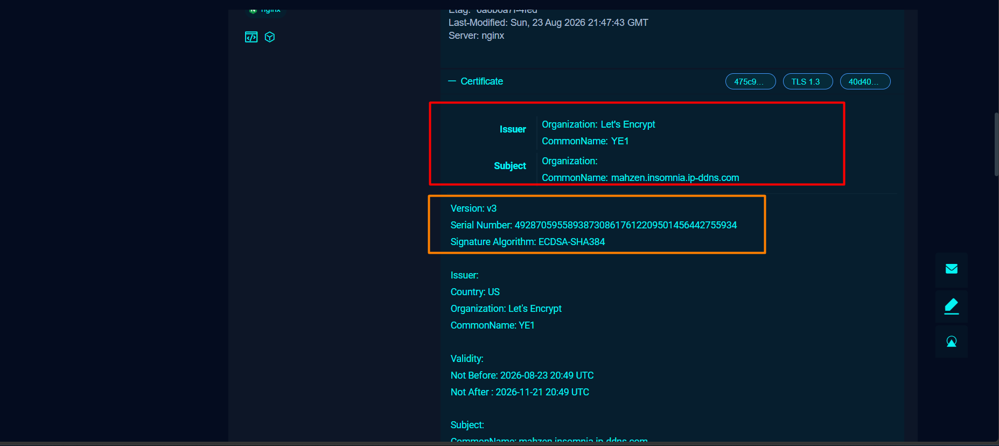

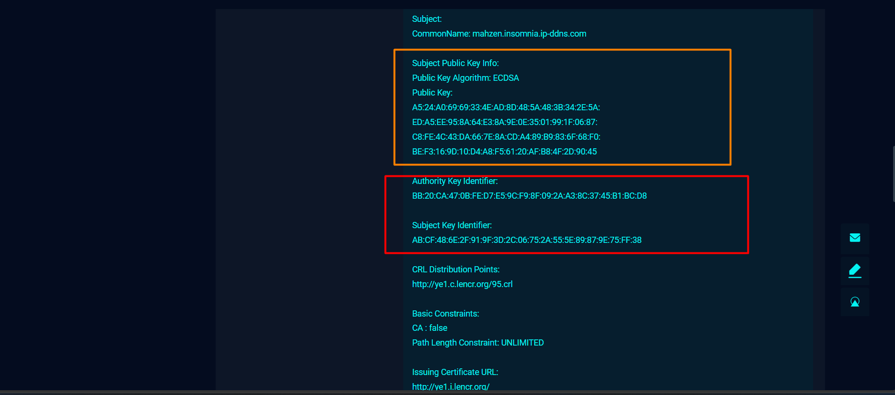

JARM goes one level deeper, and it is easier to understand with a picture in your head.

Imagine asking the same person ten questions, each phrased in a slightly different way, and writing down exactly how they react to each one. Not what they say. How they say it. After that, you could recognize them in a crowd.

That is JARM. The scanner connects to the TLS port ten times, with ten differently built hello messages (different versions, different cipher orders, different extensions). It records how the server answers each one and compresses the answers into a single string. Two servers with the same TLS stack and the same settings react the same way.

Notice what is being fingerprinted: not the certificate, but the software behind it. That is why a JARM survives a certificate change, and why we like it for clustering.

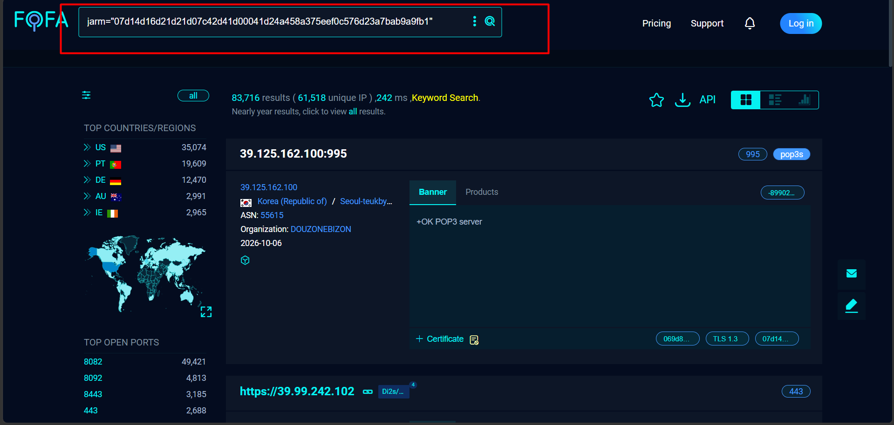

Now the limits. They matter as much as the idea.
- Unrelated servers share it. A talk at HITB 2021 pointed out that the JARM people associate with Cobalt Strike is basically the JARM of the Java TLS stack underneath it. Any ordinary Java server can look the same. So a JARM is a hint, not a verdict.
- All zeros doesn't mean clean. It means the port never completed a TLS handshake. Wrong port, or not TLS.
- It can be changed. A proxy in front of the C2 changes what the scanner sees, and tools exist to rotate JARM values on purpose.
- Better fingerprints still need help. Researchers have proposed richer TLS fingerprints than JARM, and even those needed HTTP headers next to them to catch C2 well.

A small clarification, because people mix them up. JA3 and JA3S are passive: you look at traffic you already have. JARM is active: someone connects and asks. In infrastructure hunting we mostly read scan data, so JARM is the one we meet.

JA4+ is the newer family from FoxIO, built as a successor to JA3. For server hunting, two members matter:

- JA4S, the fingerprint of the TLS server's response.
- JA4X, the fingerprint of a certificate's structure.

JA4X is the interesting one. Remember the Pikabot certificates filled with random words? Every value is different. But the shape is the same: the same fields, in the same order, because the same generator made them. A fingerprint of the shape can group certificates that no value-based search would ever connect. Check whether your engine exposes these fields, and read the license first. JA4 itself is BSD, the rest of the family has its own license for research and internal use.

### 4.2 HTTP: The Shape of the Response

Most of us read an HTTP response like a human: what does the page say? A fingerprint reads it like a machine. It cares about the shape.

- The status line, character by character.
- The set of headers and the order they come in.
- The length, and the body.

Scanners give us hashes of the headers and the body. They are cheap and powerful, and also dangerously generic. A plain 404 matches half of the internet, which is exactly what happened with the 500,000 hosts in Chapter 2.

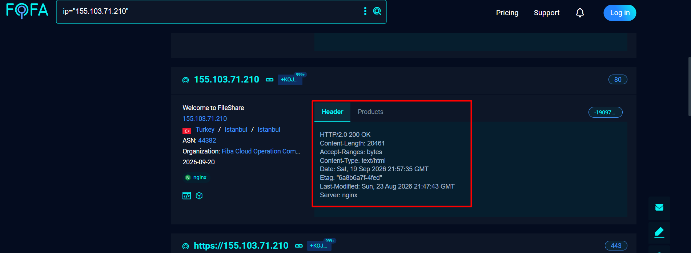

How small can a fingerprint be? Smaller than you think. There is a real story about a single extra space in a status line. I will tell it in Chapter 7, because it teaches the most important lesson of the article.

### 4.3 Content: Favicons, Titles and Panels

When the target is a panel (a RAT dashboard, a stealer backend, a phishing page), the content layer is often the best one. Operators customize the listener a lot more often than they customize the web assets that came with it.

The favicon hash is the classic trick. Shodan takes every favicon it finds, runs it through a hash function (MurmurHash3), and lets you search by the number. You can compute the same number yourself:

```python
import base64, mmh3, requests

icon_bytes = requests.get("https://example.com/favicon.ico").content
icon_b64 = base64.encodebytes(icon_bytes)   # Shodan hashes the base64 form
print(mmh3.hash(icon_b64))
```

It helps in two ways.

- Finding panels. Take the icon of a panel you already know and search for it. An operator who forgot to change it shows up even after the domain and the URL changed.
- Finding phishing. Attackers like to reuse the real brand's favicon so the fake page feels right. Search for the brand's hash, exclude the brand's own organization, add a title like "Sign in", and what is left deserves a look.

The limit: popular open source panels use the same icon on every legitimate install. A favicon tells you the panel type, not whether the owner is bad. You still need a second layer.

Titles, HTML hashes and, on URL scanners, the hashes of the scripts and images a page loaded work the same way. A copied page brings its parts with it.

### 4.4 Other Services: SSH Keys and Banners

A C2 server usually runs more than the C2. An SSH service for the operator. An FTP service for moving files. Something odd on a high port.

- SSH host key. When someone builds one server image and clones it ten times, all ten share the same host key. A Hunt.io write-up on APT34-like infrastructure describes IPs on several different hosting providers that reused one SSH key, next to domains registered at the same registrar and pointed at the same nameserver. One key looks like a coincidence. A whole setup that repeats looks like a person.
- Service banners. An unusual FTP or file-transfer banner shared by servers at one provider can reveal a cluster, especially when a vendor report describes the same banner.

EX:
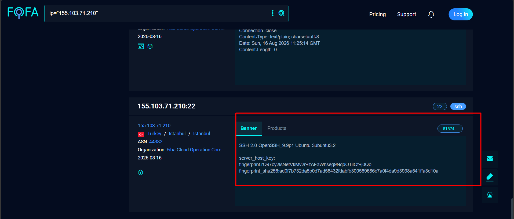

Be careful here. Hosting providers also deploy one image to many customers, and then a shared SSH key links innocent people to the actor. Treat these as leads, and write down that they are weak.

---

## Chapter 5: Open Directories and the Google Dorking Question

There is one place where operators do half of the hunter's work for us.

### 5.1 What Is an Open Directory and Why Do We Care?

An open directory is a web server with directory listing turned on. Anyone who browses to it sees a list of files. When an operator stages tools on a server and forgets to lock it, that list can show payloads, loaders, configs, logs, scripts and notes.

Where do we find them?

- Censys. It labels servers that look like directory listings, whatever the software is. A second label, suspicious-open-dir, narrows it to the ones it considers interesting. In Censys's own announcement, that took the list from hundreds of thousands to about 1,700.
- Hunt.io. Its AttackCapture engine keeps copies of the files it finds in exposed directories, so analysts can still read them after the server is gone.
- urlscan.io. Pages carry an opendir tag.
- Your own queries. Combine the directory label with a file name, a hosting provider, or a word like phishing or c2.

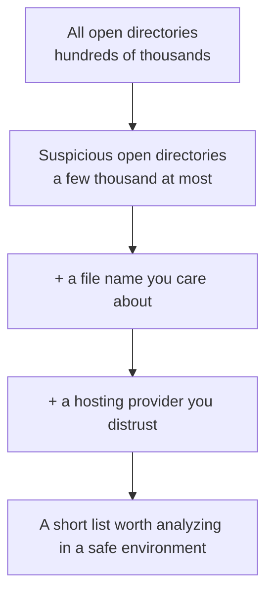

Do you see it? It is the same funnel as every Hunt  in this article. A broad idea, then constraints, until the list is small enough for a human.

(Those label names are Legacy Search syntax. On the Censys Platform, run them through the query converter.)

### 5.2 What Do We Look For Inside?

We are not browsing for fun. Everything we see is a pivot.

- File names. The same name on two different servers connects them.
- Hashes. Hash the file, then look it up in a sandbox or a sample repository. Now you moved from infrastructure to malware.
- Configs. They may list servers that no scanner has labeled yet.
- Open source tools the operator relies on. They tell you the kit.

Why does this matter? Because you see the setup before the campaign has a name. In one DPRK-related write-up from Acronis and Hunt.io, a directory was captured before other researchers had published related indicators.

### 5.3 What About Google Dorking?

People always ask about this one, so let's be honest about it.

Google dorking means using search operators like intitle:, inurl:, site: and filetype: to find specific things in Google's index. The classic example for directory listings looks like this:

```
intitle:"index of" "parent directory"
```
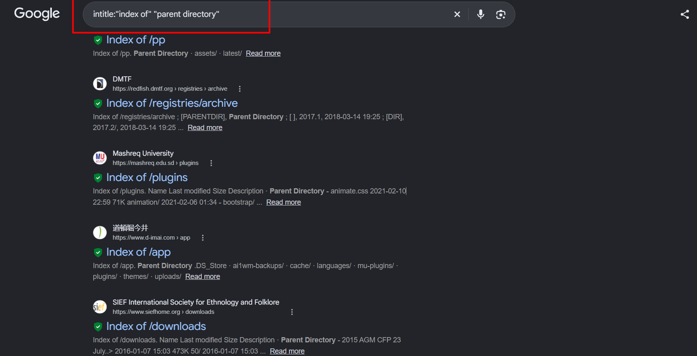

Now the part most tutorials skip. Google only knows pages its crawler reached by following links. A C2 on a bare IP, with no domain and no link pointing to it, is almost never there. To find live infrastructure, scanners and URL scanners beat Google by a wide margin. Honestly, it is the weakest tool in this article for that job.

So where does it still earn a place?

- Pivoting a rare string. You pulled something unusual from a certificate, a config or a response. Search it in quotes on Google, Bing and Yandex, because they have different indexes. Sometimes the first result is a write-up you never saw.
- Code search. Public profiles, leaked builds, deployment scripts and configs live in repositories. A search like site:github.com "unique string" can lead from a string to the code that produced it. That is the white-box idea from Chapter 3 with a different door.
- Directory listings with tool-like names, as a cheap extra next to the engines above:

```
intitle:"index of" "parent directory" ("payload" | "loader" | "stager")
```
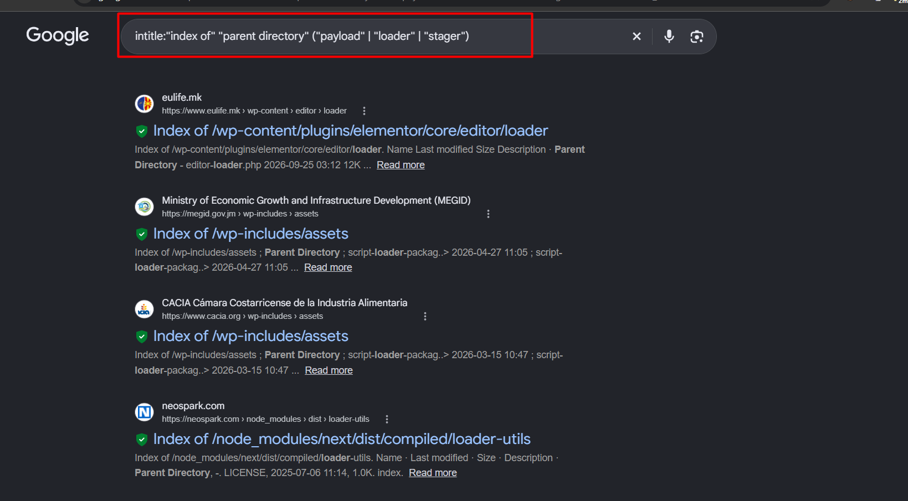

- Brand copies. A brand's phrase plus the exclusion of the brand's own domain can find clones that got indexed.

And a boundary. The public dork lists are full of queries that find exposed keys, databases, logs and passwords. That is not threat hunting. If a directory contains something that looks like victim data, we don't collect it, we don't share it, and we report it to whoever should know.

<!-- Screenshot to add: one open directory result from a scanner, with the file names visible and anything sensitive blurred. Show the reader what a staging server leaves behind. -->
---

## Chapter 6: One Layer Is Never Enough

Every single layer fails on its own. Let me show you what that looks like.

| Layer | Why it is attractive | How it fails alone |
|---|---|---|
| Hardcoded string | Extremely specific | The operator can delete it |
| Default certificate | Easy to search | The operator can replace it |
| JARM | Describes the TLS stack, so it survives a certificate change | Many unrelated servers share the same TLS stack, and it is not static |
| Header hash or body hash | Cheap and broad | Generic responses match half of the internet |
| Provider, ASN, country | Reflects actor preferences | Far too common to use alone |

Two real numbers make this clear. In the Kimsuky exercise, a JARM alone returned more than 90,000 hosts. Adding the HTTP headers of the original node dropped that to 12. Then a key size and the hosting provider tightened it further. In the Brute Ratel exercise, the headers hash alone returned more than 500,000 and only the combination with the body hash made sense.

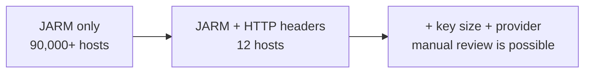

A practical note: JARM values are not static for a framework. The same C2 can show different JARMs depending on how it is deployed. So the recommendation is to keep a JARM list per C2 framework and keep adding to it, instead of trusting one value forever.

The Hunt  of thumb: use the unstable-but-specific layers together, and use the stable-but-generic layers to cut noise.

### 6.1 How Rare Is This Value?

There is one more question that saves a lot of time. For each field of your seed node: how many other hosts on the internet share this exact value?

A value is only as useful as it is rare. Think of it like this. If you are looking for one person in a crowd, "wears a jacket" is a bad clue and "has a cast on the left arm" is a good one. The same applies to servers.

You can do this by hand, with no special tool. Take the seed, search each field alone, and write down the count. Here is what the table looks like. The numbers are made up, to show the idea:

| Field from the seed | Hosts sharing it | What it is good for |
|---|---|---|
| Server header | 400,000 | Nothing alone |
| Headers hash | 150,000 | Nothing alone |
| Body hash | 30 | A strong candidate |
| Certificate fingerprint | 12 | Strong, but easy to replace |

Then you choose the rarest fields that are also stable, and you combine two of them, so the Hunt  survives when the operator changes one.

If you want the counting automated, Censys has an open source tool called Censeye that takes a host and shows how many hosts share each of its field values, and the same idea exists inside its Threat Hunting features. Check which tier you have.

The mindset: a rare value is a pivot. A common value is a filter. Know which one you are holding.

Here is the same idea as one picture. These are the doors you can open from a single node, and how much trust each one deserves on its own.


---

## Chapter 7: Attackers Adapt, So the Hunt Has to Move

Detection and evasion are a conversation. Every time we publish a fingerprint, someone changes it. The useful skill is not remembering Hunt s, it is knowing what to look at when the old Hunt  stops working.

Here is the whole chapter on one page. Every move the attacker makes removes one signal and usually leaves another.


### 7.1 They Remove the Hardcoded String (Havoc)

The default Havoc server gave itself away with a custom header. Remove that header, and the simple Hunt  is dead.

But the rest of the response is still there: the status line, the content type, the server value, the content length. So we took those, combined them with the JARM of an already confirmed Havoc host, and got a little over 20 results. Filtering by the product banner cut it down to three hosts.

Two of those three were not flagged by any vendor. How do we convince ourselves they are Havoc without the string?

By going back to the source code. The certificate generation code produces a US postal code with only four digits, while real US postal codes have five. All three hosts had a four-digit postal code in their certificate. That is a quirk the developer probably never meant to leak, and it survived because the operator never touched it.

When one signature dies, look for the thing the developer did not think to randomize.

### 7.2 They Use a Custom Certificate (Cobalt Strike)

Some operators replace the default certificate. Then the obvious certificate Hunt  stops matching.

Worse, scanners that tag servers as Cobalt Strike do it by talking to the listener and recognizing the response. In one example, the same IP had a listener on 443 that was tagged, and a team server port using the custom certificate that was not tagged. Another IP had no open listener at all, only SSH and the team server port, so nothing was tagged, and VirusTotal showed it clean.

So what does a tag really mean? It means a scanner recognized one behavior on one port. It does not mean the rest of the server is clean.

A missing tag is an absence of evidence, not evidence of absence.

### 7.3 They Hide Behind Cloudflare

This is the case people find most intimidating, so let's think it through slowly.

When a C2 domain sits behind Cloudflare, a scanner that resolves the domain only reaches Cloudflare's edge. Shodan on that IP shows Cloudflare headers, and Cloudflare headers are useless for us.

But the real server, the origin, still has to exist somewhere. And it still has to answer Cloudflare.

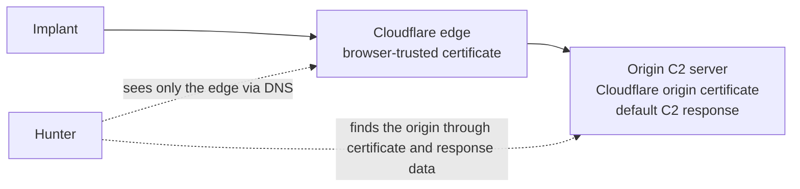

Three observations from the exercise:

- With a passive/forward DNS platform, the domain showed two kinds of hosts. Most were Cloudflare. One was not. That one carried a Cloudflare origin certificate, which is a certificate the origin installs so Cloudflare can talk to it. Seeing that certificate on a non-Cloudflare IP is a strong hint that this is the real server.
- The response from that IP looked like the default Cobalt Strike 404 response, and the JARM matched a known Cobalt Strike JARM list.
- Pivoting from the origin IP revealed more domains pointing at it, and files already known to communicate with some of them.

There is a second way in. Cloudflare only proxies a fixed list of ports. So a Hunt  can combine a default C2 response with those proxied ports, and the hits are exactly the servers an operator exposed through the proxy. In the exercise, the hits were IPs that were not behind Cloudflare while their domains were, and several domains had no public detection at all.

The mindset here: a proxy hides the domain, not the origin. The origin still has to answer someone, and if it answers a scanner, it leaks.

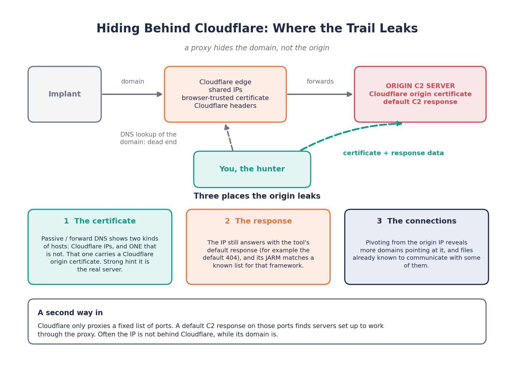

### 7.4 They Redirect and Imitate

Redirectors and malleable profiles are two forms of the same idea: make the server look like something boring.

A redirector sends anything that doesn't look like implant traffic to a harmless site. That defeats scanners that look for default C2 responses on the C2 itself. But the redirector is software, with defaults, and we already know what to do with software with defaults: read it.

A malleable profile makes the traffic look like a known service. Public profiles are public, so unique strings inside them can be searched. A custom one is not public. Be honest with yourself about which one you are dealing with, because the hunting effort is very different.

### 7.5 Every Fingerprint Has a Life Cycle

Let me tell you about one byte.

Cobalt Strike's team server used a small open source Java web server under the hood. In 2019, a researcher at Fox-IT was reading the raw responses of these servers and noticed a tiny formatting quirk in the status line: an extra space. That was enough to tell these servers apart from ordinary web servers. They went through years of public scan data and listed thousands of hosts that matched.

Now the interesting part. The vendor had already removed that space a few weeks earlier, in version 3.13, and it was even in the release notes. So the fingerprint only caught older versions.

Later, Recorded Future showed what works better: stack several quirks together. The default management port, the odd 404, the default certificate, the way the DNS side answers. Each one ages differently, so no single change kills all of them.

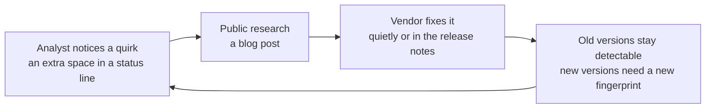

What does one byte teach us?

- Fingerprints come from careful reading, not from tools. Somebody looked at raw bytes.
- Publishing a fingerprint starts a clock. Developers read the same blogs we do.
- Old versions keep the old quirk. Unpatched, cracked and forgotten servers stay detectable, so the fingerprint is still useful for the long tail.
- A fix does not end the hunt. It moves the hunt to the next quirk.

This is also one reason operators drift to other frameworks. When the defaults of a tool are profiled by everyone, using it unchanged becomes expensive. Which brings us back to the start of the article. The tools change. The method does not.

---

## Chapter 8: Is It Really Malicious? Validation and Confidence

A result set is a list of candidates, not a list of C2 servers.

So we need a way to separate what we observed from what we conclude.

Observation: this IP returns the same response as our confirmed node, and the same JARM.

Interpretation: this server is probably the same framework with a similar setup.

Conclusion: we can say high confidence only when several independent layers agree.

The Sliver example is a good one. A certificate string from a certificate generation tool found a group of servers, none flagged by VirusTotal. The HTTP response suggested either Cobalt Strike or Sliver, and the JARM was associated with Sliver. Only four of the servers matched that JARM. So those four got high confidence, and the rest were put on a watch list instead of a blocklist.

| Evidence | What it tells us | Strength |
|---|---|---|
| Same default response as a confirmed node | Same family of behavior | Medium, many things share responses |
| Same JARM | Same TLS stack | Medium, not unique |
| Response and JARM together | Same setup | Good |
| Certificate quirk from the source code | Framework-specific trait | Strong |
| Files in a sandbox or on VirusTotal communicating with it | Live malware talking to the server | Strong |
| A sample you ran that contacted it | Behavior-confirmed C2 | Strong |
| A rare value from a beacon config, like a public key | What the attacker wrote | Strong if rare, weak if widely shared |
| Same file names in open directories on different servers | Same toolkit | Medium |
| Domain pattern, provider and OS match the actor's habits | Same operator | Supports attribution, does not prove it |

The same table as a picture. More independent evidence, more confidence.


And the other direction matters too. A clean VirusTotal page is not a verdict. Several servers in the examples above were clean there while being confirmed C2, because the detection engines never touched them.

One more thing. Your evidence usually comes from sources that saw different slices of the internet (Chapter 1.4). When you can, confirm with a second source, and not with the same scan twice.

---

## Chapter 9: From the C2 to the Operator

So far we tracked a tool. An APT is not a tool. It is a group using several tools, and the group has habits that stay the same when the tools change.

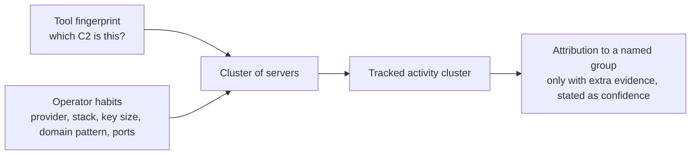

What habits are we talking about?

- Hosting. The same provider or ASN again and again. One of the North Korea linked clusters we looked at kept returning to the same provider.
- Server stack. The exact combination of web server, PHP and OpenSSL versions. Operators who automate deployment reuse the same template, and the template is visible in the response header.
- TLS choices. Even something as small as the certificate key size. That same cluster liked one specific key size, which helped cut the result set further.
- Geography. Adding a country filter removed a lot of false positives, because the actor mostly deploys near their targets.
- Domain naming. A pattern such as victim name plus a login-themed word. If you know the pattern, you can find new domains before the campaign reaches a victim.
- Registration habits. Which registrar, which nameserver, which TLD, and whether the domains are bought in batches.
- Reused content. The same image or page template across phishing pages. A hash of that content is a pivot, and it works in a different data source than the C2 hunt.
- Mistakes. Servers sharing one certificate fingerprint, a contact detail left in registration data, default responses left on in a place that should have been hardened. Operators are people, and people get lazy during deployment.

In the Scattered Spider exercise, all of this came together in a small way. The CISA report gave the domain pattern. The pattern gave a hypothesis. The hypothesis, with a hosting provider and an OS banner taken from experience, gave a Hunt . The Hunt  gave live phishing portals that were impersonating real companies, and each domain followed the same naming order.

And about attribution: it is the last step, not the first. Most of the time the honest output is a tracked cluster with this behavior, and a name is attached only when independent evidence supports it, with the confidence written next to it.

### 9.1 Can We See It Before the First Victim?

Here is where infrastructure hunting beats an IOC list by a mile. An IOC exists because somebody was already hit. Infrastructure exists before that.

Think about how an operator prepares. They don't push a button and attack. They buy domains. They get certificates. They rent servers and set them up. Then, sometimes, they wait. Every step leaves a trace somewhere we can read.

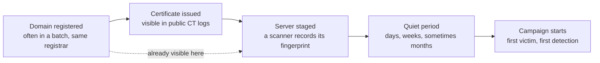

Look at the first three boxes. All of them happen before the fifth.

- Certificate transparency. Public CAs log the certificates they issue, so a new lookalike domain that gets a certificate becomes searchable. Sites like crt.sh and live feeds like CertStream let you watch for it. Most teams watch for their own brand. A hunter also watches for an actor's naming pattern.
- Registration traces. Registrar, nameserver, TLD, time of day, how many domains in one go. Individually boring. Together, a signature.
- Staging time. In the Hunt.io APT34-like write-up, one domain sat on a staging IP for more than four months without distributing anything. But the setup was already repeatable: same registrar, shared nameserver, a reused SSH key, a recognizable HTTP response, and a naming convention.

So the workflow is not complicated. Learn the actor's provisioning habits from old campaigns. Write them as Hunt s across registrations, certificates and scanner data. Run them on a schedule. When something new matches, you have a server that no feed has seen, maybe weeks before the first victim.

One discipline matters here. A pre-operational server has no communicating files yet, so by definition your evidence is only habits. That is medium confidence at best. Put it under monitoring, not on a blocklist, until something stronger arrives.

---

## Chapter 10: What the SOC Does With the Results

Hunting that stays in a search engine tab doesn't protect anyone. Once you have a result set with confidence levels, here is what to do with it.

- Retro-hunt. Search proxy, firewall and DNS logs for the IPs and domains, going back as far as retention allows. A hit tells us the infrastructure was already talking to someone in our network, and we need to know when it started.
- Separate the lists. High confidence goes to blocking and alerting. Medium goes to monitoring. Don't mix them.
- Store the Hunt , not only the IPs. The IPs will change. The Hunt  is what finds the next one. Keep it with the date, the data source and the node it came from, and rerun it on a schedule.
- Schedule only what you trust. A Hunt  that is noisy teaches the team to ignore its alerts. Run it by hand for a while, and schedule it only after it keeps giving clean, consistent results.
- Write the meaning next to the syntax. Query languages change, as the Censys move showed. If the note says what the Hunt  means in plain words, you can rebuild it in any engine.
- Expire IOCs. An IP that was a C2 six months ago may belong to someone else today.
- Write down what you observed and what you concluded. The next analyst should be able to see where the confidence came from.

---

## Chapter 11: Hunt Safely

A few Hunt s that keep you effective, and out of trouble.

- Passive first. Search engines, URL scanners, passive DNS and certificate logs don't touch the target. If you connect to a hostile server yourself, the operator may see your interest. If you must, do it from infrastructure that is not tied to your organization, and follow your policy and the law.
- Never open a suspicious server from your normal machine. Use an isolated analysis environment for pages and files.
- Don't collect victim data. If an open directory holds stolen data or personal information, stop, don't download it, don't share it, and report it to the right party.
- Keep your confidence honest. Write high, medium or low, and the reason. Overclaiming costs trust faster than anything else.
- Respect the sharing Hunt s of where you learned. If your knowledge comes from a course, a closed group or a vendor under an agreement, share the method and not the restricted indicators or screenshots, and give credit.

---

## Chapter 12: Credits and Further Reading

I learned the pieces of this from many people. These are the ones worth your time, so go to them for the details I only summarized.

- JARM by Salesforce ([github.com/salesforce/jarm](https://github.com/salesforce/jarm)), and the HITB talks on its weaknesses.
- JA4+ by FoxIO ([github.com/FoxIO-LLC/ja4](https://github.com/FoxIO-LLC/ja4)).
- Fox-IT, "Identifying Cobalt Strike Team Servers in the Wild", and Recorded Future's multi-method work on rogue Cobalt Strike servers.
- Censys: its open directory guides, its notes on Censeye and the move from Legacy Search to the Platform.
- Embee Research, for open directory hunting.
- Hunt.io, for open directory captures and for pre-operational infrastructure write-ups.
- Netlas and RST Cloud, for combining engines and scheduling hunts.
- Didier Stevens, for his beacon config parsing tools.
 for the malware-first workflow with ThreatFox, MalwareBazaar and urlscan.
- ProjectDiscovery's uncover, for querying several engines at once.
- Securelist, for yearly numbers on which C2 frameworks are really used.
- The IntelOps infrastructure hunting course, which first taught me to think this way.

---

## Where this leaves us

At this point, we have the full mindset. We start from one node, a report, a malware sample or a hypothesis. We describe it the way a scanner sees it. We write a Hunt  that is probably wrong, look at the numbers, measure how rare each value is, and add layers until the result set makes sense. We validate outside the search engine, state our confidence, and pivot on whatever is new. When the attacker changes one trait, we go back to the source or the black box and look for the next thing they didn't change. And when we are lucky, we do all of this before the first victim.

The next step is to put this into practice. In the next part, we'll take a single node and build the Hunt  step by step, with every query and every result on screen.


